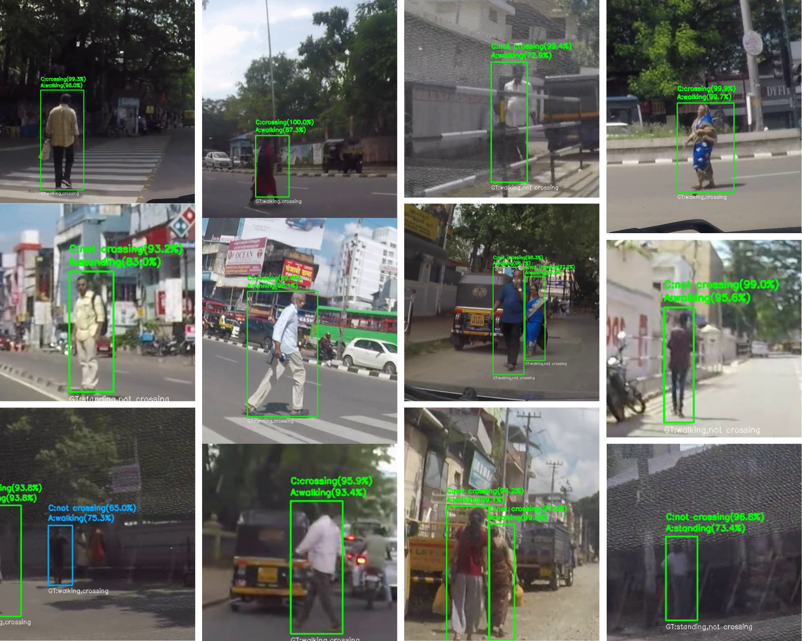

# Indian Pedestrian Intention Dataset – Subset (IPID-Subset)

[]()
[]()
[]()
[](https://opensource.org/licenses/MIT)

## Overview
This repository provides a **subset** of the Indian Pedestrian Intention Dataset (IPID).  

The **Indian Pedestrian Intention Dataset** dataset addresses a critical gap in autonomous vehicle research by capturing realistic pedestrian behaviors in **unstructured Indian traffic environments**, including jaywalking, hesitation, and sudden crossings. Unlike datasets from regulated urban settings, IPID focuses on chaotic, complex scenarios relevant to emerging markets.  



This subset contains a small selection of clips and annotations..  
*(Note: This is not the full dataset, which includes 240 clips and ~43 minutes of content.)*
---

## Dataset Characteristics
- **Number of Video Clips**: 17  
- **Total Duration**: 3 minutes 12 seconds  
- **Clip Lengths**: 6–17 seconds  
- **Resolution**: 1920×1080 (Full HD)  
- **Frame Rate**: 29.97 FPS  
- **Annotation Format**: XML (CVAT compatible)

---

## Annotation Schema

### Behavioral Labels
- **Actions**: 
  - `Standing` – Stationary pedestrian  
  - `Walking` – Pedestrian in motion  
  - `Running` – Fast-moving pedestrian  

### Intention Labels
- **Crossing Intention**:
  - `Crossing` – Pedestrian intends to or is crossing the road  
  - `Not Crossing` – Pedestrian has no immediate crossing intention  

---

## Annotation Methodology
- **Tool**: CVAT (Computer Vision Annotation Tool)  
- **Process**: Manual frame-by-frame annotation  
- **Quality**: High-precision, capturing subtle behavioral cues  
- **Criteria**: Combination of pedestrian pose and trajectory analysis  

## Repository Structure
```
ipid/
├── clips/
│ ├── clip_002.mp4
│ ├── clip_010.mp4
│ └── ...
├── annotations/
│ ├── clip_002.xml
│ ├── clip_010.xml
│ └── ...
└── README.md
```

---


## Usage

Annotations are in **CVAT-compatible XML** format.  
Example loading code:

```python
import cv2
import xml.etree.ElementTree as ET

# Load video
cap = cv2.VideoCapture('clips/clip_002.mp4')

# Parse annotations
tree = ET.parse('annotations/clip_002.xml')
root = tree.getroot()

# Process frames with annotations
for frame_id in range(int(cap.get(cv2.CAP_PROP_FRAME_COUNT))):
    ret, frame = cap.read()
    if not ret:
        break
    # Use parsed annotations here
```

## License
This dataset is released under the MIT License. See [LICENSE](LICENSE) file for details.

## Contact
For questions, suggestions, or collaboration opportunities:
- **Email**: drupaddev.p@gmail.com
- **Issues**: [GitHub Issues](https://github.com/Drupad-DeV/Indian-Pedestrian-Intention-Dataset/issues)

## Authors & Contributors

- **[Arun R](https://github.com/ArunR1408)** 
- **[Harin BS](https://github.com/harinbs)** 
- **[Jishnu B Thilak](https://github.com/jishnuthilak)** 
- **[Drupad Dev P](https://github.com/Drupad-DeV)** 

## Related Work

- [JAAD Dataset](https://github.com/ykotseruba/JAAD)
- [PIE Dataset](https://github.com/aras62/PIE)
- [CVAT Annotation Tool](https://github.com/openvinotoolkit/cvat)


## Acknowledgment
This subset is derived from the full Indian Pedestrian Intention Dataset (IPID), collected in Trivandrum, Kerala, India.
